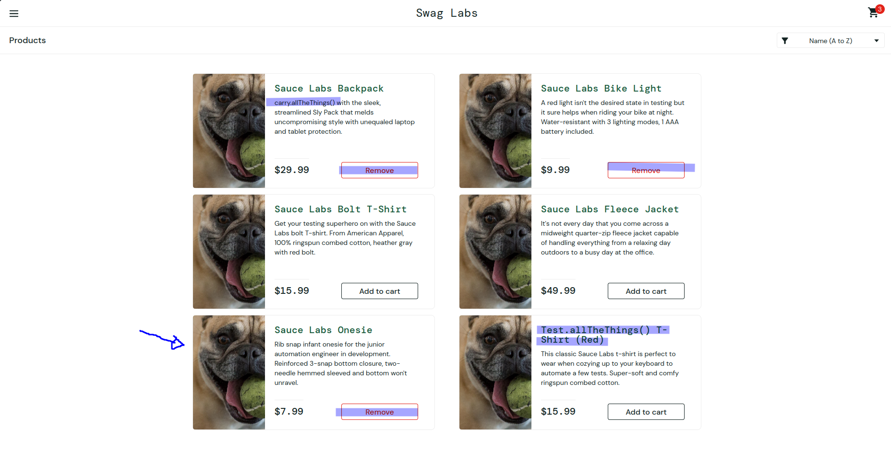

| Campo                    | Descrição                                                                                                                               |
|--------------------------|-----------------------------------------------------------------------------------------------------------------------------------------|
| Requisito Funcional      | RF 2                                                                                                                                    |
| Bug Id                   | bug-005                                                                                                                                 |
| Relacionado ao Test Case | TC-001                                                                                                                                  |
| Título                   | Botão Remove não funciona na tela Products                                                                                              |
| Severidade               | Média                                                                                                                                   |
| Prioridade               | Média                                                                                                                                   |
| Passos para reproduzir   | 1. Realizar login com o usuário problem_user   2. Adicionar um produto ao carrinho   3. Clicar no botão "Remove" na tela Products |
| Resultado obtido         | O botão não remove o produto da tela Products                                                                                           |
| Resultado esperado       | O produto deve ser removido do carrinho e o botão deve voltar a exibir "Add to cart"                                                    |
| Impacto                  | Impede o gerenciamento dos produtos diretamente pela tela Products                                                                      |
| Ambiente                 | - Ubuntu Linux 24.04.4   - Firefox   - Brave                                                                                      |
| Evidências               |                                                                                 |
| Categoria do defeito     | Funcional                                                                                                                               |

| Campo                    | Descrição                                                                       |
|--------------------------|---------------------------------------------------------------------------------|
| Requisito Funcional      | RF 2                                                                            |
| Bug Id                   | bug-006                                                                         |
| Relacionado ao Test Case | TC-002                                                                          |
| Título                   | Produtos exibem imagens incorretas                                              |
| Severidade               | Média                                                                           |
| Prioridade               | Média                                                                           |
| Passos para reproduzir   | 1. Realizar login com problem_user   2. Acessar a tela Products              |
| Resultado obtido         | Diversos produtos exibem a mesma imagem, não correspondendo ao item apresentado |
| Resultado esperado       | Cada produto deve exibir sua imagem correspondente                              |
| Impacto                  | Pode induzir o usuário ao erro durante a seleção de produtos                    |
| Evidências               |                         |
| Categoria do defeito     | Funcional / UI                                                                  |
