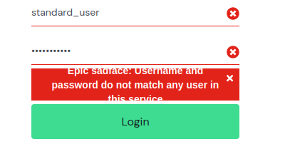

# BUG-LOGIN-001 — Mensagem de erro ultrapassa o limite do background

**Caso de teste relacionado:** TC-LOGIN-002
**Categoria:** UI
**Severidade:** Baixa
**Prioridade:** Baixa
**Ambiente:** Firefox 153.0.4 / Ubuntu 24.04.4

## Passos para reproduzir

1. Acessar `https://www.saucedemo.com/`.
2. Informar um **Username** ou **Password** inválido.
3. Clicar no botão **Login**.
4. Observar a mensagem de erro apresentada.

## Resultado obtido

Ao inserir credenciais inválidas, o sistema exibe uma mensagem de erro cujo texto ultrapassa o limite visual do background vermelho destinado à mensagem.

## Resultado esperado

A mensagem de erro deve permanecer totalmente contida dentro do espaço do background vermelho, sem ultrapassar seus limites.

## Impacto

O defeito não impede o funcionamento da autenticação, porém causa uma inconsistência visual e pode prejudicar a legibilidade da mensagem apresentada ao usuário.

## Evidência

## Status

Aberto

****