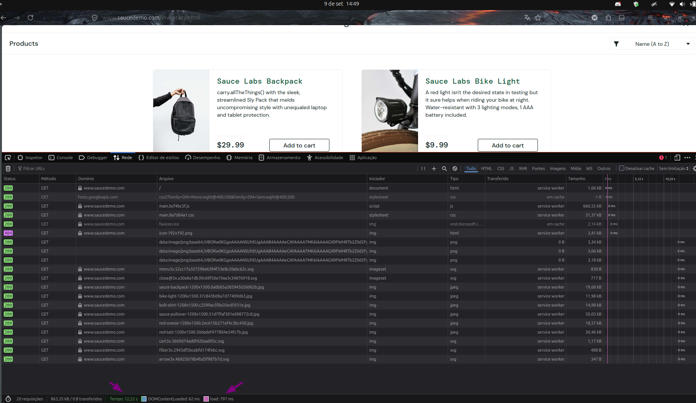

# BUG-LOGIN-PERFORMANCE_GLITCH_USER-001 — Lentidão excessiva no redirecionamento após autenticação

**Cenário relacionado:** CN-LOGIN-005 — Autenticação de usuário com comportamento de performance

**Caso de teste relacionado:** TC-LOGIN-013 — Login com performance_glitch_user

**Categoria:** Performance / Tempo de Resposta

**Severidade:** Média  
**Prioridade:** Alta

**Ambiente:** Firefox 153.0.4 / Ubuntu 24.04.4

## Passos para reproduzir

1. Acessar `https://www.saucedemo.com/`.
2. Abrir as ferramentas de desenvolvedor (`F12`) na aba **Rede** (*Network*).
3. Informar `performance_glitch_user` no campo **Username**.
4. Informar `secret_sauce` no campo **Password**.
5. Clicar no botão **Login**.
6. Aguardar o carregamento completo da página **Products** (`/inventory.html`).

## Resultado obtido

O sistema demorou entre **10,70 segundos e 14 segundos** para concluir a autenticação e carregar a página de produtos. Na aba Rede do navegador, constatou-se que o *Service Worker* reteve o envio e a busca de recursos (*fetch*) por **31,96 segundos** antes de liberar os componentes visuais.

## Resultado esperado

O sistema deve autenticar o usuário e carregar a tela de produtos em no máximo **2 a 3 segundos** , garantindo fluidez e boa experiência de uso.

## Impacto

Degradação severa da experiência do usuário no primeiro contato com a loja. Esse atraso passa a impressão de tela travada ou falha técnica, induzindo o usuário a desistir do acesso (aumento na taxa de *churn*).

## Evidência

## Status

Aberto