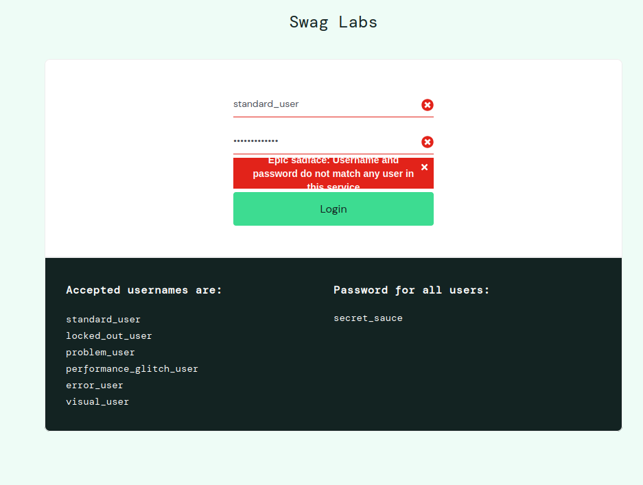

# Bug Report - Login

| Campo                     | Descrição                                                                                                 |
|--------------------------|-----------------------------------------------------------------------------------------------------------|
| Bug ID                   | BUG-LOGIN-001                                                                                             |
| Requisito Funcional      | RF-01 - Funcionalidade Login                                                                              |
| Relacionado ao Test Case | TC-LOGIN-002                                                                                              |
| Título                   | Mensagem de erro de login fica sobreposta ao background após credenciais inválidas                        |
| Severidade               | Baixa                                                                                                     |
| Prioridade               | Baixa                                                                                                     |
| Ambiente                 | Ubuntu Linux 24.04.4                                                                                      | Firefox / Brave |
| Passos para reproduzir   | 1. Acessar `https://www.saucedemo.com/`   2. Inserir credenciais inválidas   3. Clicar em **Login** |
| Resultado obtido         | A mensagem de erro é exibida com sobreposição visual, prejudicando a leitura                              |
| Resultado esperado       | A mensagem deve ser exibida de forma clara e legível, sem sobreposição                                    |
| Impacto                  | Não afeta a autenticação, mas compromete a experiência visual do usuário                                  |
| Evidências               |                                                       |
| Categoria do defeito     | Usabilidade / UI                                                                                          |
| Usuários afetados        | `standard_user`, `problem_user`, `locked_out_user`, `performance_glitch_user`                             |