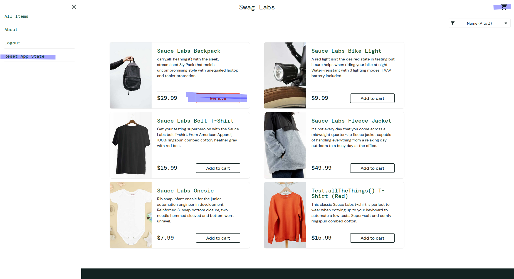
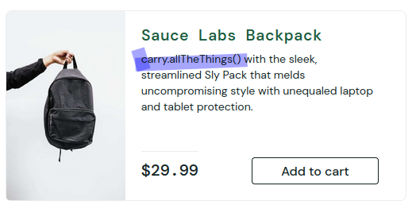
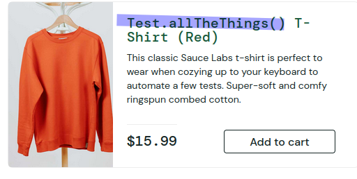

# Bug Report - Produtos

| Campo                     | Descrição                                                                                                                                                                                   |
|--------------------------|---------------------------------------------------------------------------------------------------------------------------------------------------------------------------------------------|
| Bug ID                   | BUG-PRODUTOS-001                                                                                                                                                                            |
| Requisito Funcional      | RF-02 - Funcionalidade da seção Products                                                                                                                                                    |
| Relacionado ao Test Case | TC-PRODUTOS-005                                                                                                                                                                             |
| Título                   | Botão do produto não retorna ao estado original após Reset App State                                                                                                                        |
| Severidade               | Baixa                                                                                                                                                                                       |
| Prioridade               | Baixa                                                                                                                                                                                       |
| Passos para reproduzir   | 1. Acessar `https://www.saucedemo.com/`   2. Realizar login com usuário válido   3. Adicionar um produto ao carrinho   4. Abrir o menu lateral   5. Clicar em **Reset App State** |
| Resultado obtido         | O produto é removido do carrinho, porém o botão permanece exibindo **Remove**                                                                                                               |
| Resultado esperado       | O produto deve retornar ao estado original com o botão **Add to cart**                                                                                                                      |
| Impacto                  | Gera inconsistência visual e pode confundir o usuário sobre o estado do item                                                                                                                |
| Evidências               |                                                                                                                                 |
| Categoria do defeito     | UI / Usabilidade                                                                                                                                                                            |

# Bug Report - Produtos

| Campo                     | Descrição                                                                                                                             |
|--------------------------|---------------------------------------------------------------------------------------------------------------------------------------|
| Bug ID                   | BUG-PRODUTOS-002                                                                                                                      |
| Requisito Funcional      | RF-02 - Funcionalidade da seção Products                                                                                              |
| Relacionado ao Test Case | TC-PRODUTOS-001                                                                                                                       |
| Título                   | Descrição do produto exibe texto técnico ao usuário                                                                                   |
| Severidade               | Baixa                                                                                                                                 |
| Prioridade               | Baixa                                                                                                                                 |
| Passos para reproduzir   | 1. Acessar `https://www.saucedemo.com/`   2. Realizar login com usuário válido   3. Localizar o produto **Sauce Labs Backpack** |
| Resultado obtido         | A descrição do produto exibe o texto técnico `carry.allTheThings()` ao usuário final                                                  |
| Resultado esperado       | A descrição deve apresentar conteúdo claro e adequado à experiência do usuário final                                                  |
| Impacto                  | Não afeta a funcionalidade do sistema, porém compromete a qualidade visual e a experiência do usuário                                 |
| Evidências               |                                                                        |
| Categoria do defeito     | Usabilidade / UI                                                                                                                      |

# Bug Report - Produtos

| Campo                     | Descrição                                                                                                                                           |
|--------------------------|-----------------------------------------------------------------------------------------------------------------------------------------------------|
| Bug ID                   | BUG-PRODUTOS-003                                                                                                                                    |
| Requisito Funcional      | RF-02 - Funcionalidade da seção Products                                                                                                            |
| Relacionado ao Test Case | TC-PRODUTOS-001                                                                                                                                     |
| Título                   | Nome do produto exibe nomenclatura técnica ao usuário                                                                                               |
| Severidade               | Baixa                                                                                                                                               |
| Prioridade               | Baixa                                                                                                                                               |
| Passos para reproduzir   | 1. Acessar `https://www.saucedemo.com/`   2. Realizar login com usuário válido   3. Localizar o produto **Test.allTheThings() T-Shirt (Red)** |
| Resultado obtido         | O produto é exibido com nomenclatura técnica `Test.allTheThings() T-Shirt (Red)`                                                                    |
| Resultado esperado       | O produto deve apresentar nomenclatura clara e adequada à experiência do usuário final                                                              |
| Impacto                  | Não afeta a funcionalidade do sistema, porém reduz a clareza da interface e a experiência do usuário                                                |
| Evidências               |                                                                                                                                        |
| Categoria do defeito     | Usabilidade / UI                                                                                                                                    |