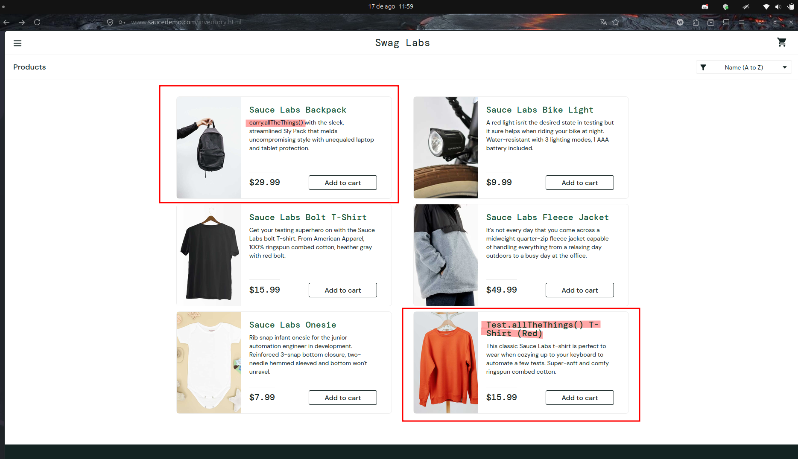

# BUG-PRODUCT-ERROR_USER-001 — Inconsistência nas informações dos produtos

**Cenário relacionado:** CN-PRODUCT-001 — Validar as informações exibidas nos produtos

**Caso de teste relacionado:** TC-PRODUCT-ERROR_USER-001

**Categoria:** Inconsistência de informações

**Severidade:** Média

**Prioridade:** Alta

**Ambiente:** Firefox 153.0.4 / Ubuntu 24.04.4

## Passos para reproduzir

1. Acessar `https://www.saucedemo.com/`.
2. Realizar login com o usuário `error_user`.
3. Acessar a página **Products**.
4. Verificar o título e a descrição dos produtos exibidos.
5. Comparar as informações apresentadas com o produto correspondente.

## Resultado obtido

Foram identificadas inconsistências no título e/ou na descrição de determinados produtos, fazendo com que as informações apresentadas não representem corretamente o item exibido.

## Resultado esperado

Todos os produtos devem apresentar título e descrição coerentes com o item correspondente, permitindo que o usuário identifique corretamente o produto.

## Impacto

Informações inconsistentes podem causar confusão durante a escolha dos produtos e prejudicar a decisão de compra do usuário.

## Evidência

## Status

Aberto

