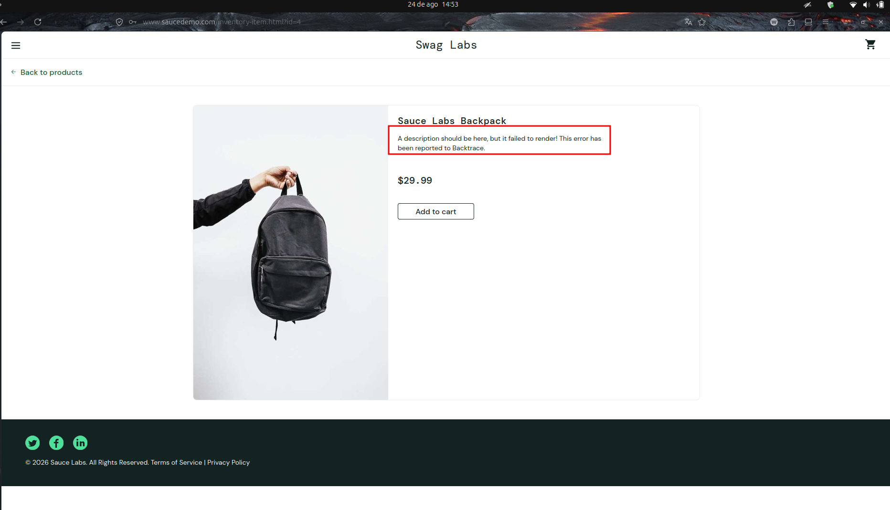

# BUG-PRODUCT-ERROR_USER-005 — Descrição dos produtos não é renderizada na página de detalhes

**Cenário relacionado:** CN-PRODUCT-005 — Validar acesso aos detalhes do produto

**Caso de teste relacionado:** TC-PRODUCT-ERROR_USER-005

**Categoria:** Funcional / Renderização de conteúdo

**Severidade:** Média

**Prioridade:** Alta

**Ambiente:** Firefox 153.0.4 / Ubuntu 24.04.4

## Passos para reproduzir

1. Acessar `https://www.saucedemo.com/`.
2. Realizar login com o usuário `error_user`.
3. Acessar a página **Products**.
4. Selecionar um produto através do nome ou da imagem.
5. Acessar sua página de detalhes.
6. Verificar a imagem, o título, a descrição e o preço.
7. Repetir a validação com diferentes produtos.

## Resultado obtido

A imagem, o título e o preço dos produtos são apresentados corretamente. Entretanto, a descrição dos produtos não é renderizada.

Em seu lugar, o sistema apresenta a mensagem:

`A description should be here, but it failed to render! This error has been reported to Backtrace.`

O comportamento ocorre nos produtos testados.

## Resultado esperado

A página de detalhes deve apresentar corretamente a imagem, o título, a descrição e o preço correspondentes ao produto selecionado.

## Impacto

A ausência da descrição impede que o usuário consulte informações importantes sobre o produto antes da compra, podendo prejudicar sua avaliação do item e sua decisão de compra.

## Evidência

## Status

Aberto