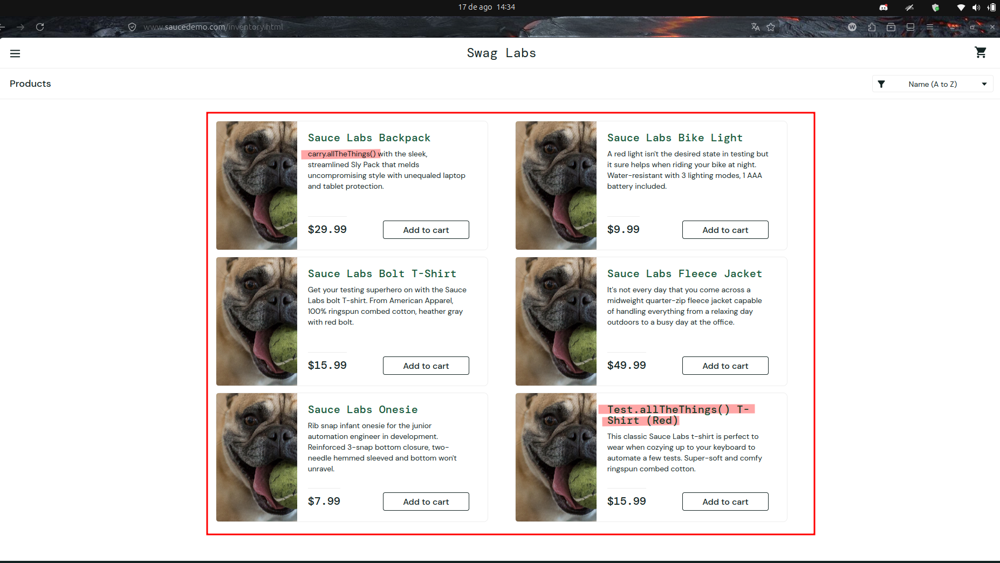

# BUG-PRODUCT-PROBLEM_USER-001 — Inconsistência nas informações dos produtos

**Cenário relacionado:** CN-PRODUCT-001 — Validar as informações exibidas nos produtos

**Caso de teste relacionado:** TC-PRODUCT-PROBLEM_USER-001

**Categoria:** Inconsistência de informações

**Severidade:** Média

**Prioridade:** Alta

**Ambiente:** Firefox 153.0.4 / Ubuntu 24.04.4

## Passos para reproduzir

1. Acessar `https://www.saucedemo.com/`.
2. Realizar login com o usuário `problem_user`.
3. Acessar a página **Products**.
4. Verificar a imagem, o título e a descrição dos produtos exibidos.

## Resultado obtido

Os produtos apresentam imagens que não correspondem aos respectivos títulos e descrições. Além disso, foram identificados produtos com conteúdo de título e/ou descrição inconsistente com as demais informações apresentadas.

## Resultado esperado

Todos os produtos devem apresentar imagem, título e descrição coerentes entre si, permitindo que o usuário identifique corretamente o produto exibido.

## Impacto

A inconsistência entre imagem, título e descrição pode causar confusão durante a escolha do produto e afetar a decisão de compra do cliente, pois as informações apresentadas não representam corretamente o item exibido.

## Evidência

## Status

Aberto
