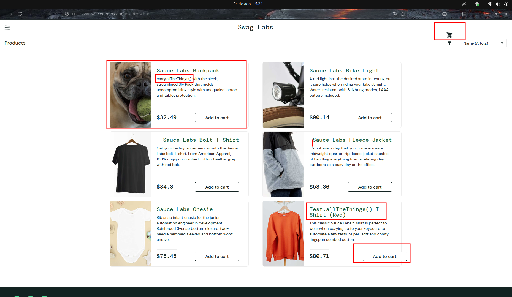

# BUG-PRODUCT-VISUAL_USER-004 — Botões dos produtos apresentam alinhamento inconsistente

**Cenário relacionado:** CN-PRODUCT-002 — Validar adição e remoção de produtos

**Caso de teste relacionado:** TC-PRODUCT-VISUAL_USER-002

**Categoria:** UI / Layout

**Severidade:** Baixa

**Prioridade:** Média

**Ambiente:** Firefox 153.0.4 / Ubuntu 24.04.4

## Passos para reproduzir

1. Acessar `https://www.saucedemo.com/`.
2. Realizar login com o usuário `visual_user`.
3. Acessar a página **Products**.
4. Observar a posição dos botões **Add to cart** nos diferentes cards de produtos.
5. Adicionar produtos ao carrinho.
6. Observar a posição dos botões **Remove** após a alteração de estado.

## Resultado obtido

Os botões **Add to cart** e **Remove** não mantêm um alinhamento visual consistente entre os diferentes cards de produtos.

Os botões são apresentados em posições diferentes dependendo do produto, causando irregularidade no layout da página.

## Resultado esperado

Os botões de ação dos produtos devem manter um posicionamento e alinhamento consistentes entre os cards, independentemente do tamanho do título, descrição ou demais informações apresentadas.

## Impacto

O defeito não impede a adição ou remoção de produtos do carrinho, porém prejudica a consistência visual da interface e deixa o layout menos organizado.

## Evidência

## Status

Aberto