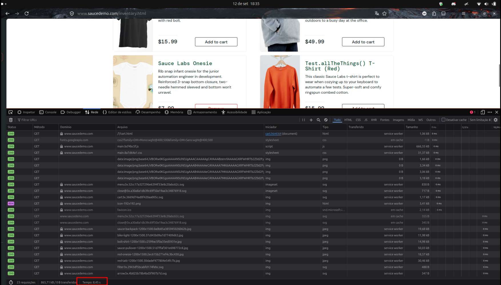

# BUG-CART-PERFORMANCE_GLITCH_USER-001 — Lentidão na transição do carrinho para a vitrine

**Cenário relacionado:** CN-CART-003 — Validar navegação de retorno às compras  
**Caso de teste relacionado:** TC-CART-PERFORMANCE_GLITCH_USER-003  
**Categoria:** Performance / Tempo de Resposta  
**Severidade:** Média  
**Prioridade:** Média  
**Ambiente:** Firefox 155 / Ubuntu 24.04

### Passos para reproduzir:
1. Acessar https://www.saucedemo.com/
2. Autenticar com o usuário `performance_glitch_user`.
3. Navegar até o carrinho (`/cart.html`).
4. Abrir as ferramentas de desenvolvedor (`F12`) na aba **Rede**.
5. Clicar no botão **Continue Shopping**.
6. Observar o tempo de carregamento da rota `/inventory.html`.

### Resultado obtido:
A transição reteve a requisição por 8,45 segundos antes de renderizar a vitrine de produtos.

### Resultado esperado:
O carregamento da vitrine deve ocorrer em até 2 segundos.

### Impacto:
Degradação da experiência do usuário no retorno às compras, gerando risco de evasão do fluxo de compra.

### Evidência

### Status:
Aberto 