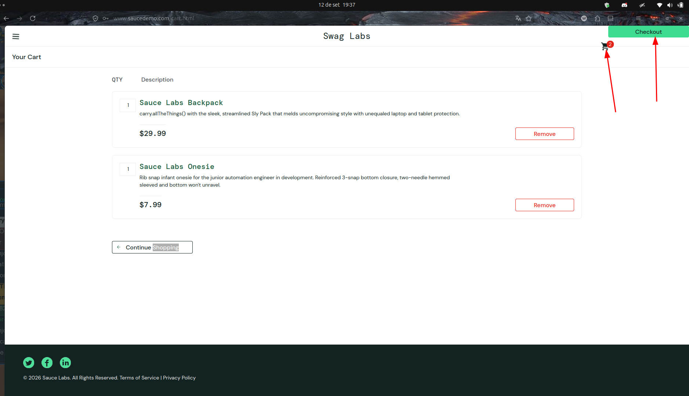

# BUG-CART-VISUAL_USER-002 — Quebra de layout no cabeçalho com deslocamento do botão Checkout e do ícone do carrinho

**Cenário relacionado:** CN-CART-005 — Validar o botão "checkout"  
**Caso de teste relacionado:** TC-CART-VISUAL_USER-005  
**Categoria:** Interface / Layout (CSS)  
**Severidade:** Média  
**Prioridade:** Alta  
**Ambiente:** Firefox 155 / Ubuntu 24.04

### Passos para reproduzir:
1. Acessar https://www.saucedemo.com/
2. Autenticar com o usuário `visual_user`.
3. Adicionar itens e acessar o carrinho (`/cart.html`).
4. Observar o canto superior direito da página.

### Resultado obtido:
O botão verde **Checkout** foi renderizado na extremidade superior direita da página, sobrepondo o cabeçalho e forçando o deslocamento vertical do ícone do carrinho para fora do alinhamento padrão da barra de navegação.

### Resultado esperado:
O cabeçalho deve conter apenas o ícone do carrinho alinhado à direita, e o botão **Checkout** deve ser exibido no rodapé da listagem, à direita do botão **Continue Shopping**.

### Impacto:
Degradação severa da usabilidade (UI/UX), poluição visual e risco de evasão de usuários que não localizam o fluxo convencional de finalização de compra.

### Evidência:

### Status:
Aberto
