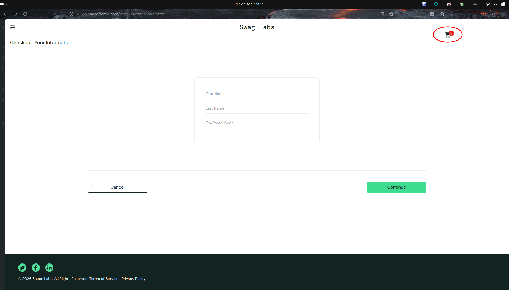

# BUG-CHECKOUT-VISUAL_USER-001 — Desalinhamento do badge numérico do carrinho no cabeçalho

**Cenário relacionado:** CN-CHECKOUT-002  
**Caso de teste relacionado:** TC-CHECKOUT-VISUAL_USER-002  
**Categoria:** Visual / Layout (CSS)  
**Severidade:** Baixa (Minor/Trivial)  
**Prioridade:** Baixa (P3)  
**Ambiente:** Firefox 155 / Ubuntu 24.04

### Descrição:
Na tela `/checkout-step-one.html`, o elemento do badge numérico que indica a quantidade de itens no carrinho não respeita o posicionamento relativo sobre o ícone do carrinho de compras, sendo renderizado deslocado para a direita da sua área delimitadora.

### Passos para reproduzir:
1. Acessar https://www.saucedemo.com/
2. Autenticar com o usuário `visual_user`.
3. Adicionar itens ao carrinho e avançar até `/checkout-step-one.html`.
4. Inspecionar o cabeçalho superior direito.

### Resultado obtido:
O círculo vermelho com a quantidade de itens aparece fora de posição em relação ao ícone do carrinho.

### Resultado esperado:
O badge deve ficar fixado sobre o canto superior direito do ícone do carrinho, centralizado e legível conforme o padrão visual da aplicação.

### Impacto:
Degradação estética da interface do usuário (UI), sem comprometimento das regras de negócio ou de conversão de compras.

### Evidência:

### Status:
Aberto